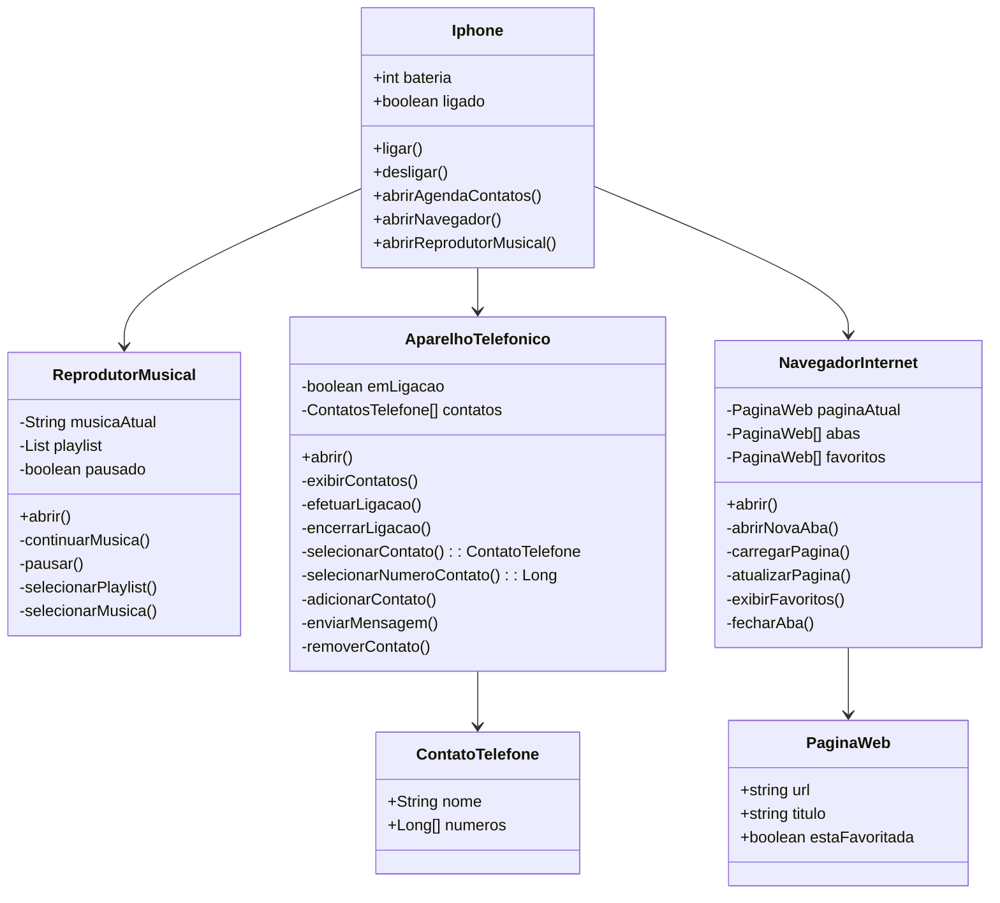

```mermaid
classDiagram
    class ReprodutorMusical {
        -String musicaAtual
        -List<String> playlist
        -boolean pausado
        
        +abrir()
        
        -continuarMusica()
        -pausar()
        -selecionarPlaylist()
        -selecionarMusica()
    }

    class ContatoTelefone {
        +String nome
        +Long[] numeros
    }
    
    class AparelhoTelefonico {
        -boolean emLigacao
        -ContatosTelefone[] contatos
        
        +abrir()
        
        -exibirContatos()
        -efetuarLigacao()
        -encerrarLigacao()
        -selecionarContato(): ContatoTelefone
        -selecionarNumeroContato(): Long
        -adicionarContato()
        -enviarMensagem()
        -removerContato()
    }

    class PaginaWeb {
        +string url
        +string titulo
        +boolean estaFavoritada
    }
    
    class NavegadorInternet {
        -PaginaWeb paginaAtual
        -PaginaWeb[] abas
        -PaginaWeb[] favoritos
        
        +abrir()

        -abrirNovaAba()
        -carregarPagina()
        -atualizarPagina()
        -exibirFavoritos()
        -fecharAba()
    }

    class Iphone {
        +int bateria
        +boolean ligado
        +ligar()
        +desligar()
        +abrirAgendaContatos()
        +abrirNavegador()
        +abrirReprodutorMusical()
    }

    Iphone --> ReprodutorMusical
    Iphone --> AparelhoTelefonico
    Iphone --> NavegadorInternet
    
    AparelhoTelefonico --> ContatoTelefone
    
    NavegadorInternet --> PaginaWeb
```